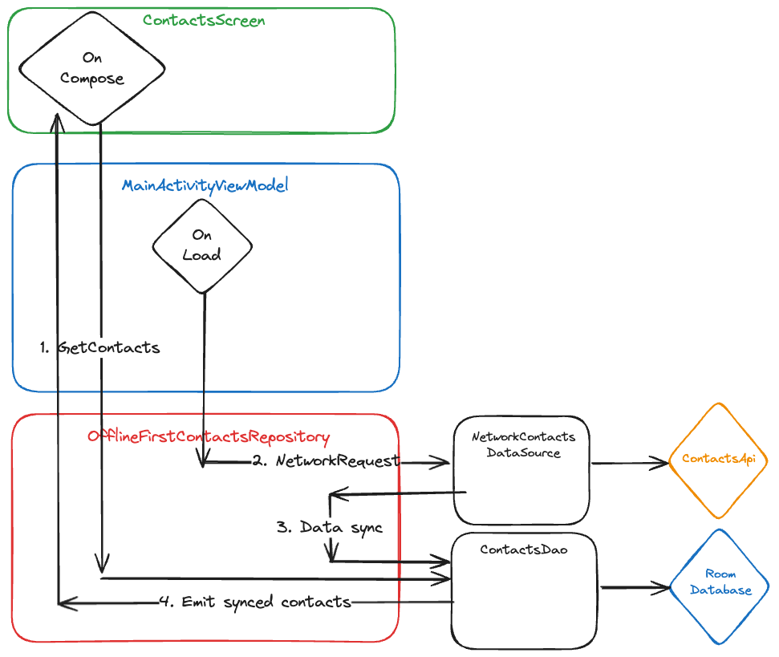

# Easy Contacts app

This is a simple app that fetches a list of contacts from an API and displays them in a list.
I have used this repo to understand different concepts of modern Android development.
Some of the code is based in the official [NowInAndroid project](https://github.com/android/nowinandroid) but simplified.

This repo can be useful to understand:
- How to use Room to store data in a local database.
- How to use Retrofit to fetch data from an API.
- How to use Hilt for dependency injection.
- How to use ViewModels and Flows to manage UI-related data.
- How to manage secrets in a secure way.
- How to use the offline first architecture.
- How to show messages to the user using Snackbars.

## Real API

If you want to use a real API, you can use the following URL based on the project (https://github.com/alexgt9/contacts-api):
```
BACKEND_URL=https://contacts-api-yy1b.onrender.com/
```

## Data flow

This app use a simple offline first architecture to fetch and display a list of contacts.   
The contacts are fetched from the local database and displayed in the UI.  
Then the app fetches the contacts from an API and stores them in a local database.  
That trigger the update in the UI with the latest info (always reading from the local database as the source of truth).

In summary, the data flow is as follows:
- `ContactDao` (Local Database) -> `ContactsScreen` (User Interface)
  And at the same time
- API -> `OfflineFirstContactsRepository` -> `ContactDao` (Local Database) -> `MainActivityViewModel` -> `ContactsScreen` (User Interface).



## Folder structure

- data/: This directory contains classes related to data handling, such as models, database access objects (DAOs), and repositories. It's further divided into:
  - database  
  - database/: This directory contains classes related to the local database, such as ContactDao.  
  - model/: This directory contains data model classes, such as Contact.  
  - network/: This directory contains classes related to network operations, such as ContactsNetworkDataSource and OfflineFirstContactsRepository.  
  - repository/: This directory contains repository classes, such as ContactsRepository.
- ui/: This directory contains classes related to the user interface. It's further divided into:  
  - screens/: This directory contains classes for different screens in the application, such as ContactsScreen.  
  - components/: This directory contains reusable UI components.
- MainActivity.kt: This is the main activity of the application.
- MainActivityViewModel.kt: This is the ViewModel for the main activity.

## Snackbar

It used snackbar instead of Toast to show messages to the user.

## Secrets

In the provided code, secrets are managed using the `com.google.android.libraries.mapsplatform.secrets-gradle-plugin` plugin. 
This plugin allows you to securely manage and access secrets during the build process.

The plugin uses a properties file to store the secrets. 
The default file name is local.properties, this file shouldn't be included in version control.
In addition you can have a default secrets file, I specify the name in the `secrets` block in the `build.gradle.kts` file:

```kotlin
secrets {
    defaultPropertiesFileName = "secrets.defaults.properties"
}
```

You can commit this file with some defaults values, so the project can be built without the need of the local.properties file.

The secrets file is a standard Java properties file, where each line represents a key-value pair. For example:
```
api_key=YOUR_API_KEY
```

To access a secret in your code, you can use the `BuildConfig` class, which is automatically generated during the build process. 
For example, to access the `api_key` secret, you would use `BuildConfig.api_key`.
